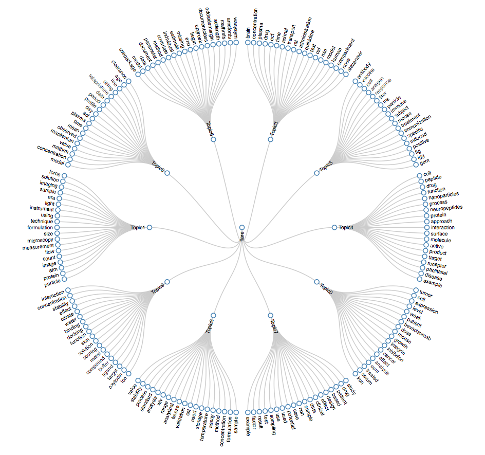
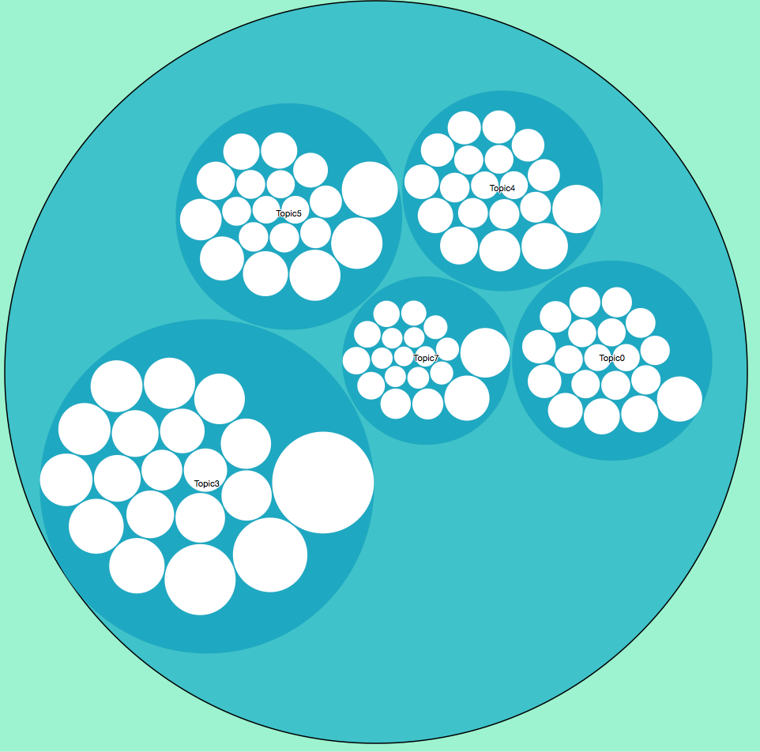
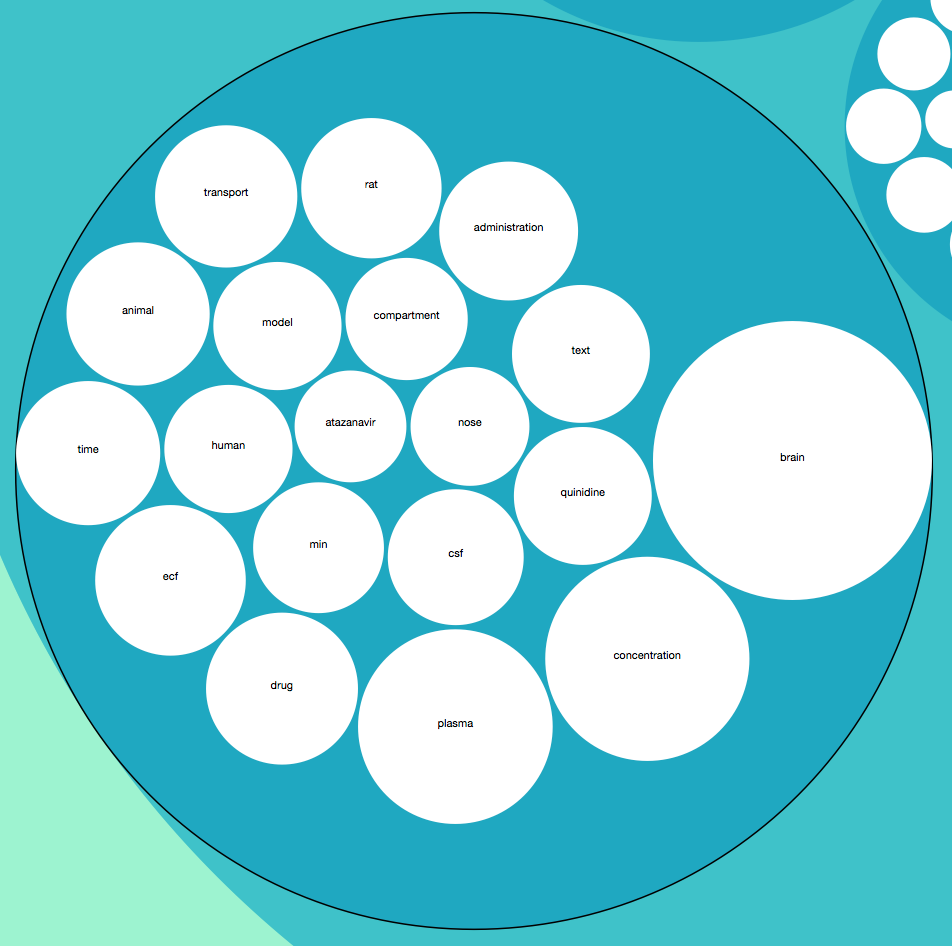
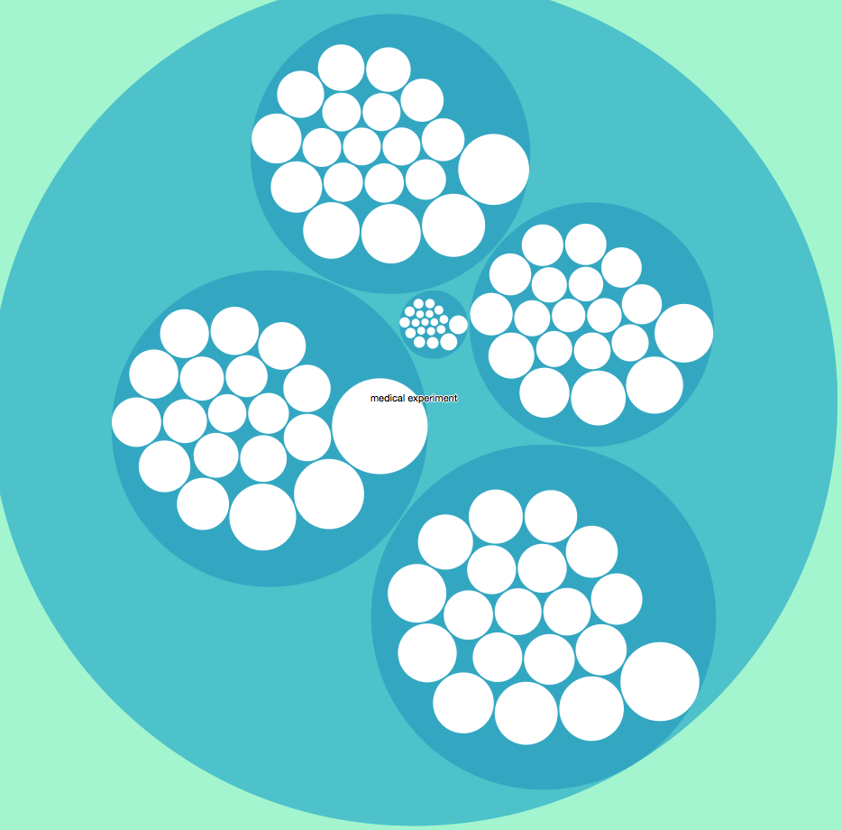
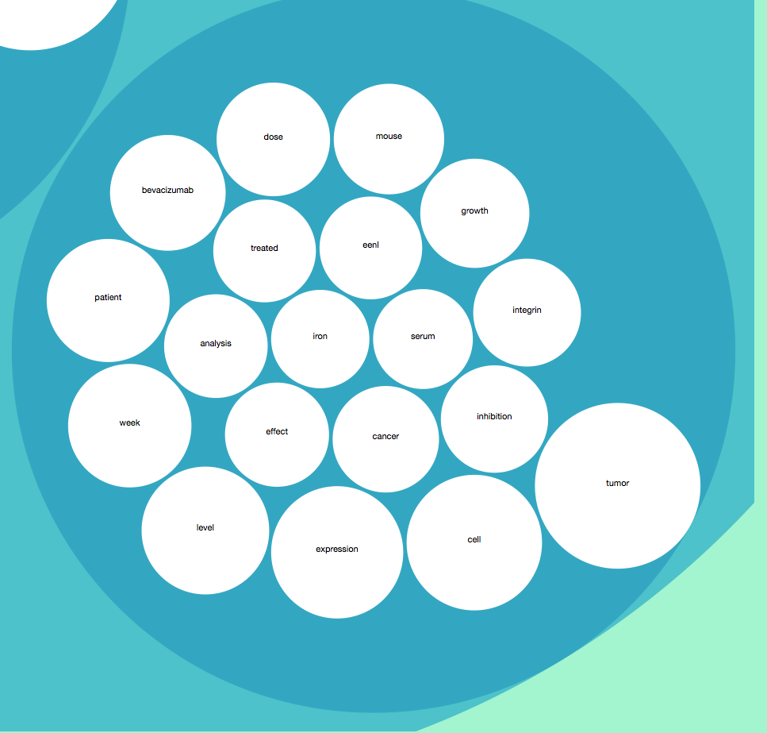
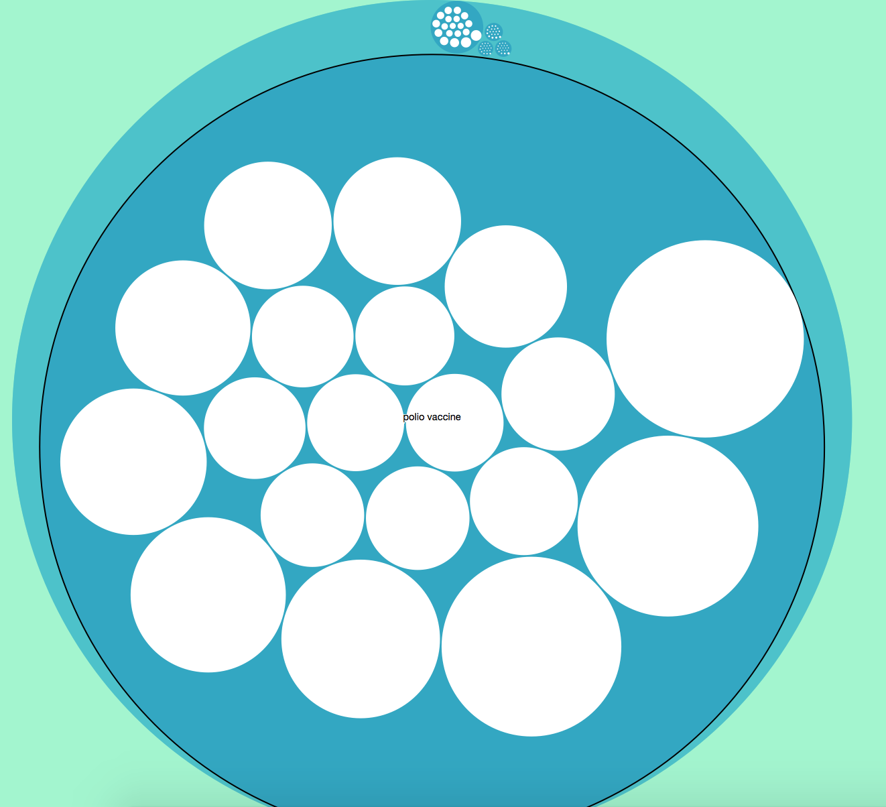

# Final Project Notebook

Eryue Chen (eryuec)

## Problem Statement

This project is foucues on big data text processing. A set of documents from Pubmed Central dataset are provided. The aim is to find the most commonly co-occur topics with the given term. The problem needs to be solved based on the analysis of documents, calculation of its term features and comparison with the given term.

To solve this problem, there are several steps. First, the documents are preprocessed to extract all the terms, transform them into stemmed format and discard all the stop words. Second, all the terms need to be calculated based on its occurrence in the documents and each document should be represented by several topic terms. Third, all the documents are categorized into several topics based on the statistics model. Finally, the given term should be compared with existing topics and documents to decide which topic fits best with it.

## Topic Detection

### Docuemnt Indexing

First, the documents are indexed and stored into a csv file with a given id and the path of the document. This will help for later analysis.


```python
with open('data/sessions.csv', 'wb') as csvfile:
    spamwriter = csv.writer(csvfile, delimiter=',', quotechar='|', quoting=csv.QUOTE_MINIMAL)
    id = 0
    spamwriter.writerow(['docId', 'docName'])
    for root, dir, files in os.walk('data/sessions/'):
        for items in fnmatch.filter(files, "*.nxml"):
            filename = root + "/" + items
            spamwriter.writerow([id, filename])
            id += 1
```

### Term Extraction & Preprocess

Second, the terms are extracted from the documents using BeautifulSoup which can help to select useful contents from xml format files. Only the paragraph section in the body part are taken into calculation. Then each term is lemmatized and filtered by stop words using natual language toolkit. 


```python
sessions = {}
lemmatizer = nltk.WordNetLemmatizer()
stopwords = stopwords.words('english')
with open("data/sessions.csv", "r") as sessions_file:
    reader = csv.reader(sessions_file, delimiter = ",")
    reader.next() # header
    for row in reader:
        session_id = int(row[0])
        filename = row[1]
        page = open(filename).read()
        soup = BeautifulSoup(page)
        bodies = select(soup, "body p")
        content = ""
        for body in bodies:
            for word in wordpunct_tokenize(body.text):
                if word not in stopwords:
                    lemmed = lemmatizer.lemmatize(word).lower()
                    if (len(lemmed) < 3 or (not lemmed.isalpha())): continue
                    content += lemmed + " "
        sessions[session_id] = {"abstract" : content, "title": filename}

corpus = []
titles = []
for id, session in sorted(sessions.iteritems(), key=lambda t: int(t[0])):
    corpus.append(session["abstract"])
    titles.append(session["title"])
```

### Topic Extraction

With the corpus prepared, term vector can be build and the model is build using Latent Dirichlet Allocation. According to LDA model, each document is a mixture of a small number of topics and that each word's creation is attributable to one of the document's topics. Therefore, each topic is composed of a number of words. And each document is classified into a topic whihc is represented by several topic words. After the topics are extracted, the topic model is stored into files, so that it can be reused to classify given terms.


```python
vectorizer = CountVectorizer(analyzer='word', ngram_range=(1,1), min_df = 0, stop_words = 'english')
matrix =  vectorizer.fit_transform(corpus)
feature_names = vectorizer.get_feature_names()

vocab = feature_names

model = lda.LDA(n_topics=10, n_iter=500, random_state=1)
model.fit(matrix)
topic_word = model.topic_word_
n_top_words = 20

with open('data/model.csv', 'wb') as csvfile:
    spamwriter = csv.writer(csvfile, delimiter=',', quotechar='|', quoting=csv.QUOTE_MINIMAL)
    spamwriter.writerow([x.encode('utf-8') for x in feature_names])
    for y in range(len(model.topic_word_)):
        spamwriter.writerow([x for x in model.topic_word_[y]])
```

### Term Classification

The program accepts user input for terms. As the topic model is stored, each term is compared with the each topic and sorted by the similarity factor value. The result gives the top five topics and outputted to flare.json format.


```python
__author__ = 'eryue'
import csv
import nltk
import json
import operator
import numpy as np

feature_names = []
topic_word = []

with open("data/model.csv", "r") as modelfile:
    reader = csv.reader(modelfile, delimiter = ",")
    feature_names = [x for x in reader.next()]
    for row in reader:
        word = []
        for x in row:
            word.append(float(x))
        topic_word.append(word)

jsondata = {}
jsondata["name"] = "flare"
jsondata["children"] = []

n_top_words = 20
lemmatizer = nltk.WordNetLemmatizer()
while (True):
    term = raw_input("Input term: ")
    if (term == ""): break

    termjson = {}
    termjson["name"] = term
    termjson["children"] = []

    terms = term.split(" ")
    scores = {}
    for i in range(0, 10):
        scores[i] = 0
    for t in terms:
        t = lemmatizer.lemmatize(t)
        for i in range(0, len(feature_names)):
            if (t == feature_names[i]):
                for j in range (0, len(topic_word)):
                    scores[j] = scores[j] + topic_word[j][i]
    sort_scores = sorted(scores.iteritems(), key=operator.itemgetter(1), reverse=True)
    count = 0
    for (k, v) in sort_scores:
        print v
        topic_words = np.array(feature_names)[np.argsort(topic_word[k])][:-n_top_words:-1]
        print('Topic {}: {}'.format(k, ' '.join(topic_words).encode('utf-8')))
        topicjson = {}
        topicjson["name"] = "Topic" + str(k)
        topicjson["size"] = v
        topicjson["children"] = []
        sum = 0
        for t in topic_words:
            tjson = {}
            tjson["name"] = t
            for i, word in enumerate(feature_names):
                if (t == word):
                    tjson["size"] = topic_word[k][i]
                    sum += topic_word[k][i]
            topicjson["children"].append(tjson)
        for topic in topicjson["children"]:
            topic["size"] = (topic["size"] / sum) * v
        termjson["children"].append(topicjson)
        count += 1
        if (count >= 5): break
    jsondata["children"].append(termjson)

with open("data/flare.json", "w") as jsonfile:
    jsonfile.write(json.dumps(jsondata))

```

### D3 Visualization

#### Topics

All the topics can be shown as below using Cluster Dendrogram:


#### Input term and phrase

Among all the visualization formats, I chose to visualzie it with Zommable Circle Packing. The outmost circle is the input term. Then there are five circles, each representing a topic. Inside each topic circle, there are twenty circles, each representing a topic term. All the circle sizes are proportional to the factor of co-occurrence. 

The example graph for term "human" is shown as below:



The exmaple graph for phrase "medical experiment" is shown as below:



## Experiments

### Lemmatization and Stopwords

Before lemmatization: Both "vaccine" and "vaccines" are in the topic words. Therefore, the words need lemmatization to combine these two words together.

Before removing stopwords: There are some topic words like: "ml", "12pt", "mg". These are units which appear often in the scientific documents. Even though the english stop words are excluded, these words are still retained. Therefore, we need to manually filter these stop words.

The topic terms are listed as below

Before lemmatization and removing stopwords:

Topic 0: cells macitentan vaccine lns antigen act immune particles specific vaccines wiv mice ln immunization ligand gem titers response responses

Topic 1: formulation transport used drug nose analytical analysis direct method rate dose temperature nasal humans administration process pk data stability

Topic 2: patients study samples bevacizumab sampling assay method sample csf aβ42 concentration non design range pharmacokinetic accuracy clearance concentrations atazanavir

Topic 3: treatment 12 rhuph20 exposure time subjects period antibodies used plasma using antibody day respectively 16 fig ml 10 similar

Topic 4: oxytocin mm serum kg treated buffer iron effect mg 10 hepcidin ions week animals 207 metal abt am8 h5f9

Topic 5: brain model plasma concentrations mathrm usepackage concentration ecf text time quinidine csf min models distribution observed compartment data administration

Topic 6: drug target based potential clinical drugs development et studies small approach including specific pk effects nanoparticles example used current

Topic 7: usepackage model data document missing covariate estimates begin end boldsymbol 69pt wasysym mathrsfs amsbsy amsmath amsfonts upgreek minimal methods

Topic 8: protein particle particles afm flow μm ml microscopy counts high 10 light size using era imaging images sample measurements

Topic 9: tumor expression di cells growth mice integrin tp eenl neuropeptides cell cancer α2 levels inhibition peptide 2b c4 peptides

After lemmatization and removing stopwords:

Topic 0: tumor cell expression level week patient bevacizumab dose mouse growth integrin inhibition cancer effect analysis eenl treated serum iron

Topic 1: particle protein afm image count flow measurement microscopy size formulation technique using instrument light era sample imaging solution force

Topic 2: sample formulation concentration method assay temperature storage used csf validation freeze analytical range wiv analysis standard process stability value

Topic 3: brain concentration plasma drug ecf time animal transport rat administration quinidine text csf min model human compartment nose atazanavir

Topic 4: cell peptide drug function nanoparticles process neuropeptides protein approach interaction surface molecule active product target receptor paclitaxel disease example

Topic 5: antibody vaccine cell antigen response titer lns particle immune subject mouse treatment immunization specific induced positive fig igg gem

Topic 6: usepackage model data document parameter method covariate individual estimate missing end begin upgreek documentclass oddsidemargin setlength mathrsfs amsfonts wasysym

Topic 7: study drug patient based design effect clinical data sample non case potential used use sampling test result factor example

Topic 8: model concentration mathrm value macitentan observed mean time plasma act day profile period data telapristone using line age clearance

Topic 9: ion oxytocin target ligand buffer compound metal scoring solution skin function docking binding water citrate effect stability concentration interaction

### Factors of model

#### 1.Number of iteration

Comparing 100 iterations and 1000 iterations, there are 7 terms different between the same topic:

1000 iterations: scoring skin docking effect citrate stability concentration

100 iterations: formulation used study investigation result current scoring

The terms in 1000 iterations have more meaningful reflect on the document contents, rather than the structure words of the documents.

The topics are listed as below:

100 iterations:

Topic 0: tumor level patient effect expression cell observed analysis dose treatment using clinical bevacizumab growth human model clearance mouse cancer

Topic 1: particle protein afm image count flow measurement size formulation using microscopy instrument technique light sample solution era imaging high

Topic 2: sample concentration method temperature assay storage csf validation freeze recovery analytical wiv standard performed range high liquid accuracy stability

Topic 3: brain concentration plasma text ecf rat animal min csf administration usepackage time compartment drug transport atazanavir human microdialysis total

Topic 4: cell drug peptide function direct nanoparticles nose transport human neuropeptides approach protein surface delivery tissue interaction molecule nasal receptor

Topic 5: antibody vaccine cell response antigen titer lns serum immune subject particle iron mouse specific positive fig immunization hepcidin induced

Topic 6: usepackage model data document parameter method covariate estimate individual missing end begin wasysym oddsidemargin documentclass amssymb upgreek amsbsy amsfonts

Topic 7: drug study design based patient case effect sample product clinical data non result sampling example software size development factor

Topic 8: model concentration mathrm value time period macitentan study quinidine profile observed day act predicted tissue blood plasma line mean

Topic 9: formulation target ion oxytocin used study investigation ligand result buffer function solution interaction binding current compound metal water scoring

1000 iterations:

Topic 0: tumor cell expression level patient week bevacizumab dose mouse growth integrin inhibition cancer treated eenl serum iron effect analysis

Topic 1: particle protein afm image count flow measurement microscopy instrument technique using light size high era formulation solution imaging force

Topic 2: sample formulation method concentration used assay temperature csf storage range validation result standard analysis analytical level rate stability dissolution

Topic 3: brain concentration plasma ecf time transport animal drug rat text model quinidine administration csf min human usepackage compartment nose

Topic 4: cell peptide nanoparticles process function neuropeptides product approach surface active specific drug receptor interaction component molecule small protein target

Topic 5: antibody vaccine cell response antigen titer lns subject immune particle wiv mouse treatment induced fig specific immunization positive igg

Topic 6: usepackage model data document parameter method covariate individual estimate missing end wasysym oddsidemargin begin mathrsfs amssymb setlength amsfonts right

Topic 7: study drug patient based clinical effect design data sample non potential used case sampling number different exposure observed use

Topic 8: model concentration mathrm value macitentan observed mean day time act profile plasma period telapristone using age predicted line software

Topic 9: ion oxytocin target ligand buffer function compound solution metal scoring skin binding docking effect water citrate interaction stability concentration


#### 2.Number of topics

Comparing 10 topics and 20 topics, we consider the appearance of "study" term.

10 topics: "study" appears in one topic

20 topics: "study" appears in five topic

If there are too many topics, the topics are more likely to overlap with each other.

The 20 topics version is listed as below:

Topic 0: data method missing covariate estimate model individual parameter effect value male observed bias covariates estimation set estimated imputation sex

Topic 1: drug study effect potential interaction mechanism clinical combination cytokine risk vitro tps current patient cardiac channel level therapeutic safety

Topic 2: study design sampling patient sample covariate cost size power number sparse pharmacokinetic calculation individual statistical variability unit effect using

Topic 3: target function molecule interaction ligand binding based scoring structure specific docking complex compound showing multiple recent factor active protein

Topic 4: brain plasma concentration ecf drug transport animal rat text quinidine administration csf time human min compartment nose distribution direct

Topic 5: product process nanoparticles drug component delivery size surface paclitaxel development manufacturing characteristic approach nanoparticle property potential critical based nanomedicines

Topic 6: cell vaccine antigen response lns particle immune wiv mouse titer antibody specific immunization gem nps igg injection adjuvant influenza

Topic 7: using data fig used result drug observed time mean different shown table compared performed concentration similar value group difference

Topic 8: particle protein count flow measurement formulation instrument solution size era microscopy light vial sample fim particulate coulter concentration mfi

Topic 9: sample concentration assay csf validation range level accuracy method dilution precision recovery diluted tween prior value donor established run

Topic 10: antibody cell week treatment subject eenl tumor treated iron hepcidin expression positive gene cancer titer tissue serum level mouse

Topic 11: skin cell gemini drug compound surfactant permeation cpe effect used control spacer enhancer usa mathrm effective solution ketoprofen caffeine

Topic 12: usepackage document model end begin left right documentclass mathrsfs oddsidemargin wasysym setlength amssymb amsfonts upgreek amsbsy amsmath minimal parameter

Topic 13: afm peptide cell neuropeptides force image vesicle channel secretory tip imaging cantilever panel right protein neuropeptide fig left membrane

Topic 14: temperature oxytocin buffer freeze ion storage solution liquid metal stability water process stored rate min citrate freezing dried drying

Topic 15: macitentan period act day concentration treatment rifampin subject patient uptake metabolite study mean plasma versus increase hemoglobin steady geometric

Topic 16: patient bevacizumab atazanavir concentration clearance nomogram non bilirubin asian agc plasma observed exposure population adherence pharmacokinetic event monitoring expected

Topic 17: model mathrm concentration value profile observed pbpk predicted dissolution time sampling fraction site cmax data skin study prediction conc

Topic 18: method formulation study used sample analysis analytical investigation test preparation dose result review standard change solution time assessed oos

Topic 19: model tumor integrin expression growth telapristone inhibition mouse cdb level clearance renal dose rate preclinical effect solid line day


### Ways to integrate terms to phrase

Taking the phrase "polio vaccine" as the example. 

#### 1.Using mininum score of all terms

Topic 9: ion oxytocin target ligand buffer compound metal scoring solution skin function docking binding water citrate effect stability concentration interaction

Topic 5: antibody vaccine cell antigen response titer lns particle immune subject mouse treatment immunization specific induced positive fig igg gem

Topic 1: particle protein afm image count flow measurement microscopy size formulation technique using instrument light era sample imaging solution force

Topic 0: tumor cell expression level week patient bevacizumab dose mouse growth integrin inhibition cancer effect analysis eenl treated serum iron

Topic 3: brain concentration plasma drug ecf time animal transport rat administration quinidine text csf min model human compartment nose atazanavir


#### 2.Using average or sum score of all terms

Topic 5: antibody vaccine cell antigen response titer lns particle immune subject mouse treatment immunization specific induced positive fig igg gem

Topic 4: cell peptide drug function nanoparticles process neuropeptides protein approach interaction surface molecule active product target receptor paclitaxel disease example

Topic 9: ion oxytocin target ligand buffer compound metal scoring solution skin function docking binding water citrate effect stability concentration interaction

Topic 1: particle protein afm image count flow measurement microscopy size formulation technique using instrument light era sample imaging solution force

Topic 0: tumor cell expression level week patient bevacizumab dose mouse growth integrin inhibition cancer effect analysis eenl treated serum iron


Here, "vaccine" is a term that has more weight than "prolio". If it uses minimum, the result will tend to emphasize on "prolio". If it uses average, the result will tend to emphasize on "vaccine". 

A reasonable way is to include the popularity of each term when dealing with the phrase. We need to give discount to terms that are popular in the  corpus so that it will not overwhelm the effect of other terms in the phrase. The improvement can be done by using tf-idf metrics.

## Error Analysis

The possible error may come from several aspects:

1. There are stop words that are specific to medical articles. The english stop words are not enough for use.

2. The topic detection may have overlapping with several topics. The terms representing each topic may have overlapping in meanings.

3. When identifying the topic mostly similar to the given term, it utilizes the model matrix to find the most common topic. There are many other factors that can be considered to find the topic that fits best.

4. There are popular words in phrases that may overwhelm the effects of other terms, which may lead to bias in results. 

## Conclusion

The method in this project can effectively detect and categorize all the documents into different topics. After experiments, all the parameters are set as the best value. The steps are concluded as below:

First, the terms are extracted from documents, stemmed and filtered by stop words. 

Second, all documents are featurized and categorized into different topics. 

Thrid, the given term should be compared with documents and assigned with most common topics.

Finally, the results are visualized with D3 tools.

## Future Work

First try to filter and featurize all the documents in a more accurate way. 

Second, it can focus on better algorithm of topic detection, which can avoid too much overlap between different topics. 

Third, introduce tf-idf or other better metrics to balance the influence of all the terms in input phrases.

In this way, the result can be more accurate.

## Reference

https://en.wikipedia.org/wiki/Latent_Dirichlet_allocation

http://www.markhneedham.com/blog/2015/03/05/python-scikit-learnlda-extracting-topics-from-qcon-talk-abstracts/

http://bl.ocks.org/mbostock/7607535

http://bl.ocks.org/mbostock/4339607
