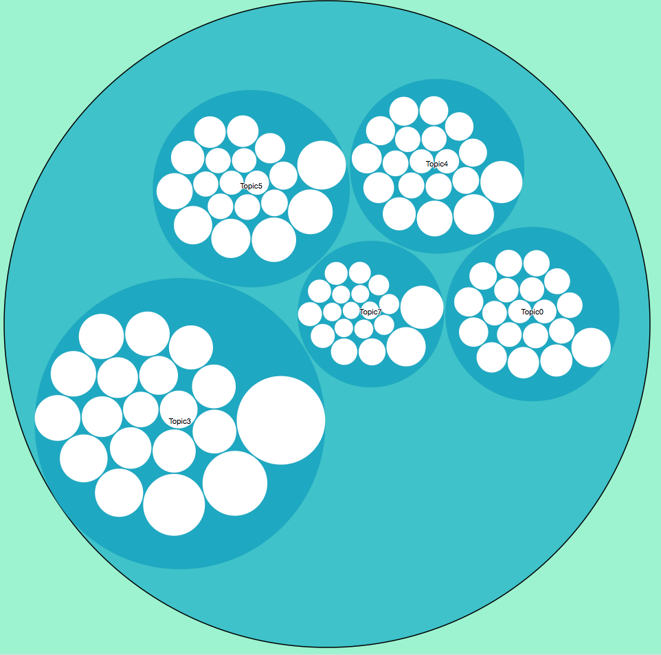
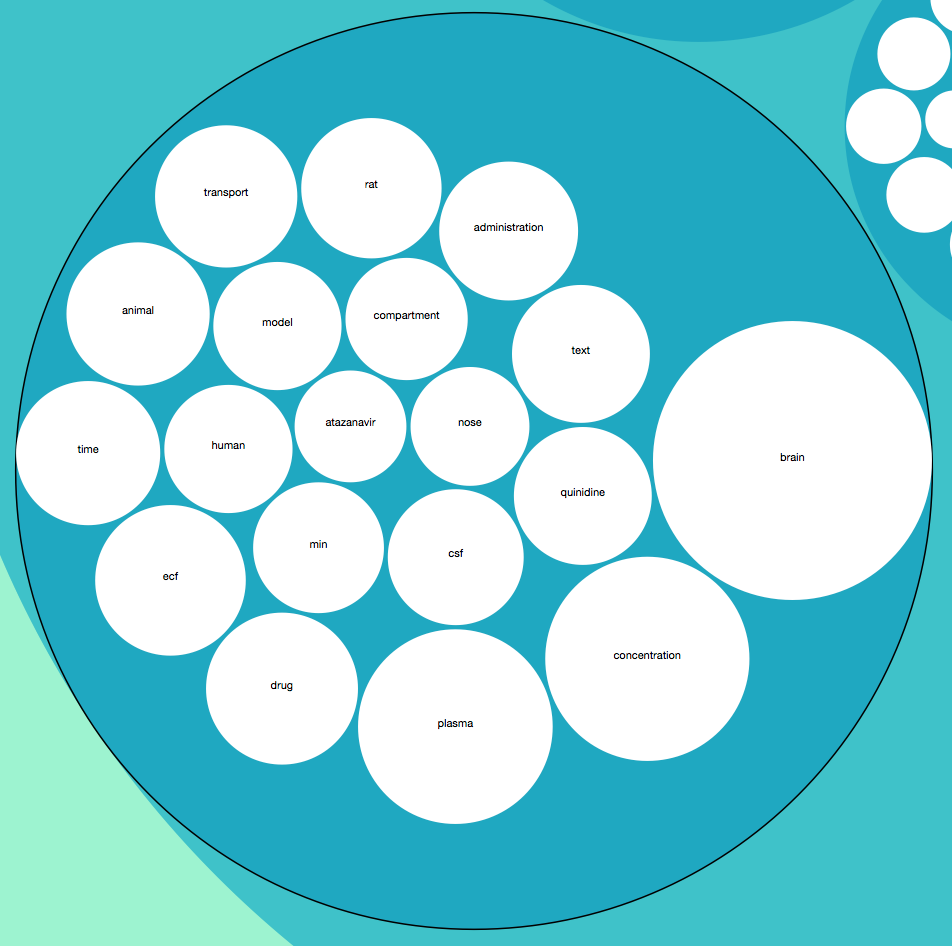

# Final Project Notebook

Eryue Chen (eryuec)

## Problem Statement

This project is foucues on big data text processing. A set of documents from Pubmed Central dataset are provided. The aim is to find the most commonly co-occur topics with the given term. The problem needs to be solved based on the analysis of documents, calculation of its term features and comparison with the given term.
To solve this problem, there are several steps. First, the documents are preprocessed to extract all the terms, transform them into stemmed format and discard all the stop words. Second, all the terms need to be calculated based on its occurrence in the documents and each document should be represented by several topic terms. Third, all the documents are categorized into several topics based on the statistics model. Finally, the given term should be compared with existing topics and documents to decide which topic fits best with it.

## Topic Detection

### Docuemnt Indexing

First, the documents are indexed and stored into a csv file with a given id and the path of the document. This will help for later analysis.


```python
with open('data/sessions.csv', 'wb') as csvfile:
    spamwriter = csv.writer(csvfile, delimiter=',', quotechar='|', quoting=csv.QUOTE_MINIMAL)
    id = 0
    spamwriter.writerow(['docId', 'docName'])
    for root, dir, files in os.walk('data/sessions/'):
        for items in fnmatch.filter(files, "*.nxml"):
            filename = root + "/" + items
            spamwriter.writerow([id, filename])
            id += 1
```

### Term Extraction & Preprocess

Second, the terms are extracted from the documents using BeautifulSoup which can help to select useful contents from xml format files. Only the paragraph section in the body part are taken into calculation. Then each term is lemmatized and filtered by stop words using natual language toolkit. 


```python
sessions = {}
lemmatizer = nltk.WordNetLemmatizer()
stopwords = stopwords.words('english')
with open("data/sessions.csv", "r") as sessions_file:
    reader = csv.reader(sessions_file, delimiter = ",")
    reader.next() # header
    for row in reader:
        session_id = int(row[0])
        filename = row[1]
        page = open(filename).read()
        soup = BeautifulSoup(page)
        bodies = select(soup, "body p")
        content = ""
        for body in bodies:
            for word in wordpunct_tokenize(body.text):
                if word not in stopwords:
                    lemmed = lemmatizer.lemmatize(word).lower()
                    if (len(lemmed) < 3 or (not lemmed.isalpha())): continue
                    content += lemmed + " "
        sessions[session_id] = {"abstract" : content, "title": filename}

corpus = []
titles = []
for id, session in sorted(sessions.iteritems(), key=lambda t: int(t[0])):
    corpus.append(session["abstract"])
    titles.append(session["title"])
```

### Topic Extraction

With the corpus prepared, term vector can be build and the model is build using Latent Dirichlet Allocation. According to LDA model, each document is a mixture of a small number of topics and that each word's creation is attributable to one of the document's topics. Therefore, each topic is composed of a number of words. And each document is classified into a topic whihc is represented by several topic words. After the topics are extracted, the topic model is stored into files, so that it can be reused to classify given terms.


```python
vectorizer = CountVectorizer(analyzer='word', ngram_range=(1,1), min_df = 0, stop_words = 'english')
matrix =  vectorizer.fit_transform(corpus)
feature_names = vectorizer.get_feature_names()

vocab = feature_names

model = lda.LDA(n_topics=10, n_iter=500, random_state=1)
model.fit(matrix)
topic_word = model.topic_word_
n_top_words = 20

with open('data/model.csv', 'wb') as csvfile:
    spamwriter = csv.writer(csvfile, delimiter=',', quotechar='|', quoting=csv.QUOTE_MINIMAL)
    spamwriter.writerow([x.encode('utf-8') for x in feature_names])
    for y in range(len(model.topic_word_)):
        spamwriter.writerow([x for x in model.topic_word_[y]])
```

### Term Classification

The program accepts user input for terms. As the topic model is stored, each term is compared with the each topic and sorted by the similarity factor value. The result gives the top five topics and outputted to flare.json format.


```python
n_top_words = 20
lemmatizer = nltk.WordNetLemmatizer()
while (True):
    term = raw_input("Input term: ")
    if (term == ""): break
    term = lemmatizer.lemmatize(term)

    termjson = {}
    termjson["name"] = term
    termjson["children"] = []
    for i in range(0, len(feature_names)):
        scores = {}
        if (term == feature_names[i]):
            for j in range (0, len(topic_word)):
                scores[j] = topic_word[j][i]
            sort_scores = sorted(scores.iteritems(), key=operator.itemgetter(1), reverse=True)
            count = 0
            for (k, v) in sort_scores:
                print v
                topic_words = np.array(feature_names)[np.argsort(topic_word[k])][:-n_top_words:-1]
                print('Topic {}: {}'.format(k, ' '.join(topic_words).encode('utf-8')))
                topicjson = {}
                topicjson["name"] = "Topic" + str(k)
                topicjson["size"] = v
                topicjson["children"] = []
                sum = 0
                for t in topic_words:
                    tjson = {}
                    tjson["name"] = t
                    for i, word in enumerate(feature_names):
                        if (t == word):
                            tjson["size"] = topic_word[k][i]
                            sum += topic_word[k][i]
                    topicjson["children"].append(tjson)
                for topic in topicjson["children"]:
                    topic["size"] = (topic["size"] / sum) * v
                termjson["children"].append(topicjson)
                count += 1
                if (count >= 5): break
            jsondata["children"].append(termjson)

with open("data/flare.json", "w") as jsonfile:
    jsonfile.write(json.dumps(jsondata))

```

### D3 Visualization

Among all the visualization formats, I chose to visualzie it with Zommable Circle Packing. The outmost circle is the input term. Then there are five circles, each representing a topic. Inside each topic circle, there are twenty circles, each representing a topic term. All the circle sizes are proportional to the factor of co-occurrence. The example graph for term "human" is shown as below:


```python
from IPython.display import Image
Image(filename='pic1.png')
```





```python
from IPython.display import Image
Image(filename='pic2.png')
```





## Experiments

### Lemmatization and Stopwords

Before lemmatization: Both "vaccine" and "vaccines" are in the topic words. Therefore, the words need lemmatization to combine these two words together.
Before removing stopwords, there are some topic words like: "ml", "12pt", "mg". These are units which appear often in the scientific documents. Even though the english stop words are excluded, these words are still retained. Therefore, we need to manually filter these stop words.

### Factors of model

1. Number of iteration
Comparing 100 iterations and 1000 iterations, there are 7 terms different between the same topic:
1000 iterations: scoring skin docking effect citrate stability concentration
100 iterations: formulation used study investigation result current scoring
The terms in 1000 iterations have more meaningful reflect on the document contents, rather than the structure words of the documents.

2. Number of topics
Comparing 10 topics and 20 topics, we consider the appearance of "study" term.
10 topics: "study" appears in one topic
20 topics: "study" appears in five topic
If there are too many topics, the topics are more likely to overlap with each other.

## Error Analysis

The possible error may come from several aspects:
1. There are stop words that are specific to medical articles. The english stop words are not enough for use.
2. The topic detection may have overlapping with several topics. The terms representing each topic may have overlapping in meanings.
3. When identifying the topic mostly similar to the given term, it utilizes the model matrix to find the most common topic. There are many other factors that can be considered to find the topic that fits best.

## Conclusion

The method in this project can effectively detect and categorize all the documents into different topics. After experiments, all the parameters are set as the best value. The steps are concluded as below:
First, the terms are extracted from documents, stemmed and filtered by stop words. 
Second, all documents are featurized and categorized into different topics. 
Thrid, the given term should be compared with documents and assigned with most common topics.
Finally, the results are visualized with D3 tools.

## Future Work

The future work can first try to filter and featurize all the documents in a more accurate way. Second, it can focus on better algorithm of topic detection, which can avoid too much overlap between different topics. In this way, the result can be more accurate.

## Reference

https://en.wikipedia.org/wiki/Latent_Dirichlet_allocation
http://www.markhneedham.com/blog/2015/03/05/python-scikit-learnlda-extracting-topics-from-qcon-talk-abstracts/
http://bl.ocks.org/mbostock/7607535

